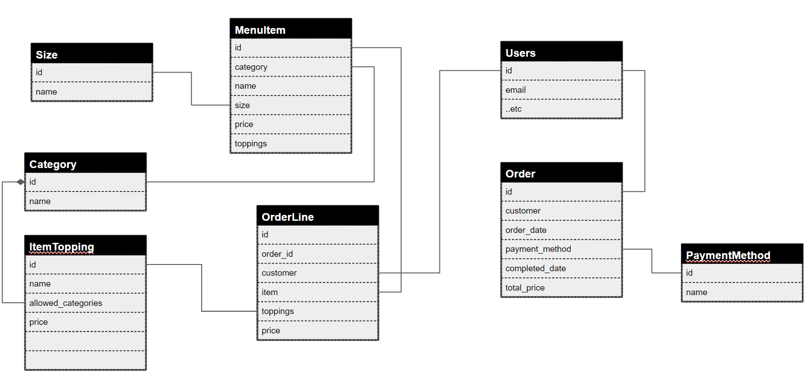
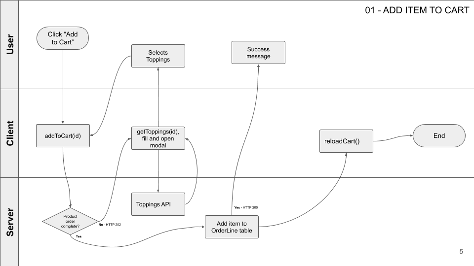

# cs50p3 - Pizzeria

## Setup
python manage.py loaddata data.json

## Overview

Build using [Materialize]() - A modern responsive front-end framework based on Material Design

### Entity Relationship Diagram

### Process Flow - Add item to Cart

### User Management
- Username is automatically populated with email value on backend

### Order Management
- Items added to cart are created in OrderLine but without an order ID
- Once order is submitted, a Order record is created and the order id for OrderLine items for given user are populated
